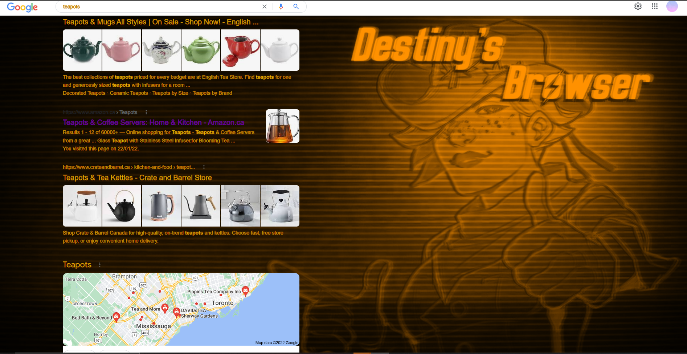
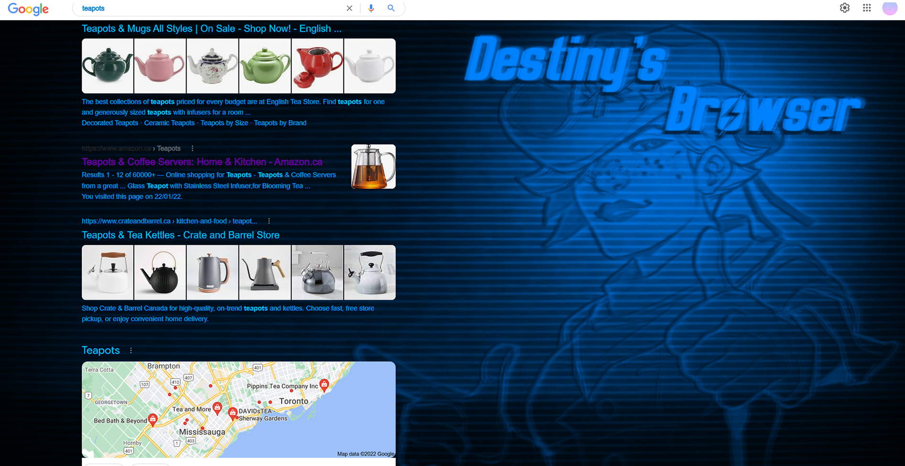
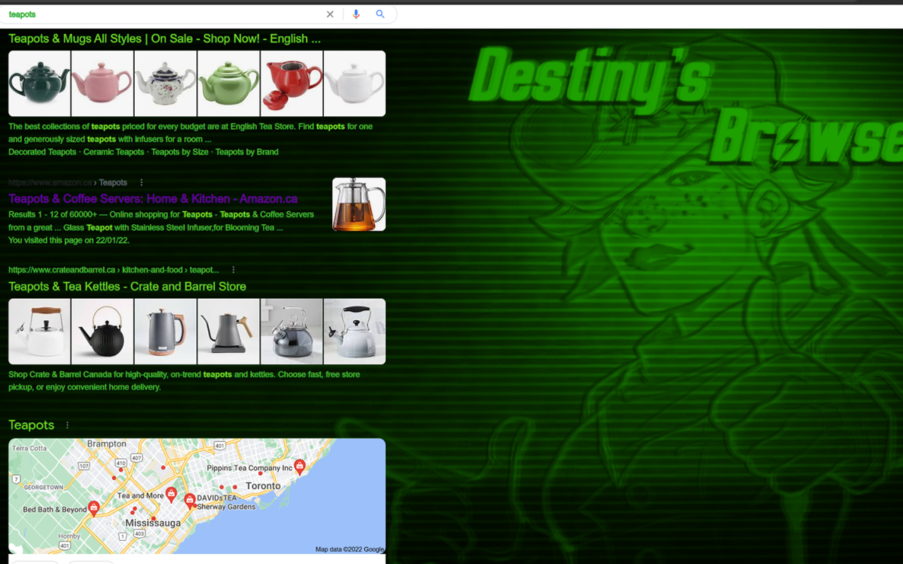
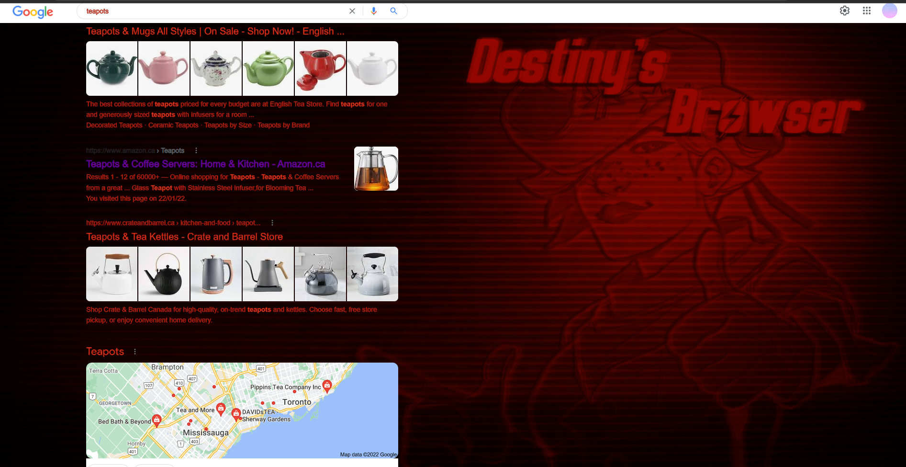
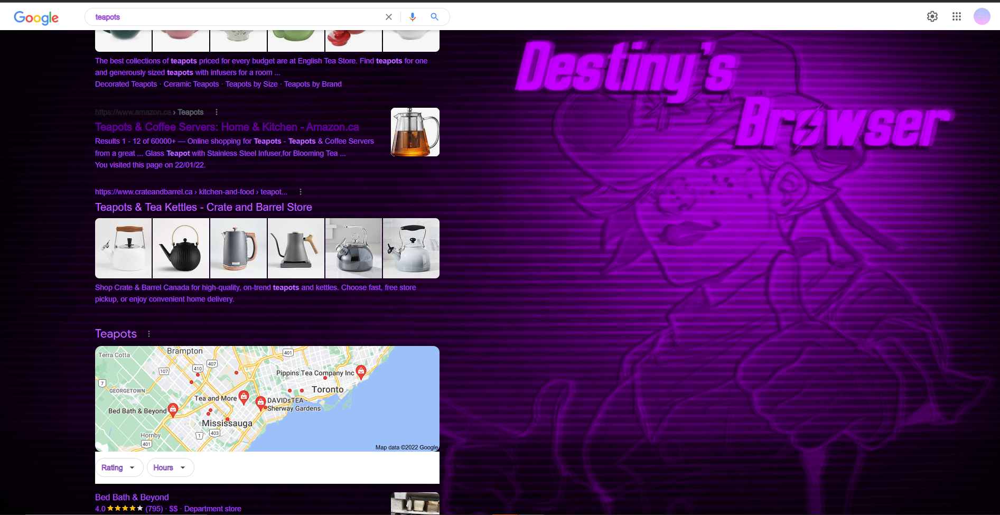
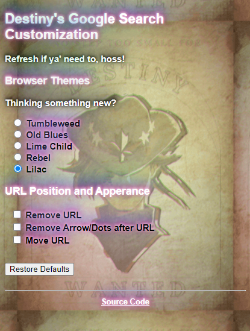

 # Extension Basis

 Destiny's Browser is a Chrome search browser visual overhaul.  By utilizing :root to set changeable colour variables to my CSS, HTML radio buttons, and JavaScript, the Destiny's Browser extension changes the background image, text colour, and stroke colour of the regular search page.  There are five different colour schemes to choose from: Tumbleweed, Old Blues, Lime Child, Rebel, and Lilac.  The user can alternate between the five themes easily without the need to refresh the browser.  Additionally, the extension can alter the URL position and appearence.

 1. Tumbleweed

 

 2. Old Blues

 

 3. Lime Child

 

 4. Rebel

 

 5. Lilac

 
 
 

---

# Artistic Statement and Technological Reflection

The main point of Destiny's Browser was to tackle the unbearing simplicity of coporate art style and design schemes.  The base tools to make something more of the search page besides a light or dark mode were lacking, so I wanted to build an extension that added personality and a few customization feature.  Chrome itself allows you to change Chrome themes with add-ons and through the Chrome Web Store.  These supplement the Chrome homepage with wallpapers, searchbars and tab customization, but rarely have I seen themes that can 1.) Let you swap between themes all within a popup and 2.) Customize the search page.  I acknowledge that users spend little time staring at a single search page and the neccessity of visual clarity, but personal customization is a great form of self-expression, and the means publically avaialble to customize the Chrome browser beyond the homepage are next to none.  

To concur, I wanted Destiny's Browser to pose the question: "Why do we need to settle for simplicity?  Why aren't there tools available, to whose who want them, to make something more of the little things like the search page background or text colour?"  And, guided by that question, I built the extension as a form of solution.  

Artistic comments aside, in this extension, for the technological coding aspect I focused on Radio Button code and manipulation.  
---

# So, Who's Destiny and Why is This Her Browser?

Destiny is a character I created and designed with a friend.  She's an characterized AI; a rebellious cowgirl who's here for a job well done.  The background image of the search page is her giving the user a thumbs up, and the background of the popup is her wanted poster.  With the flavour text provided in the Popup, she's suggested to be the one handling the changes to the search page.  Destiny is meant to be fun mascot for the extension, giving it more personality with her style and presence.

Popup
 

Icons

Destiny Official art and Concept

